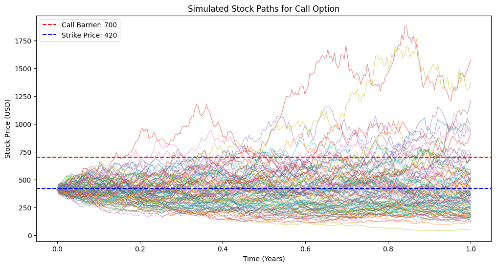
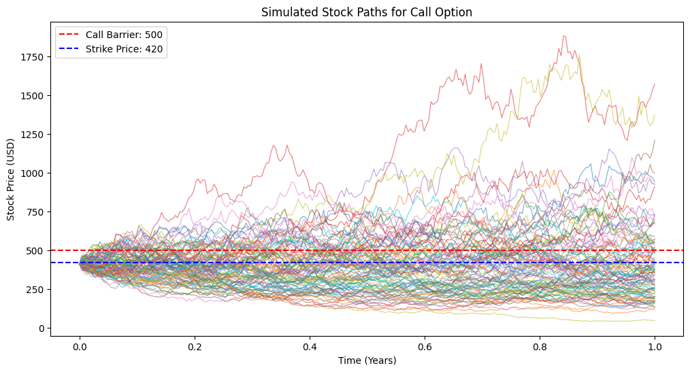
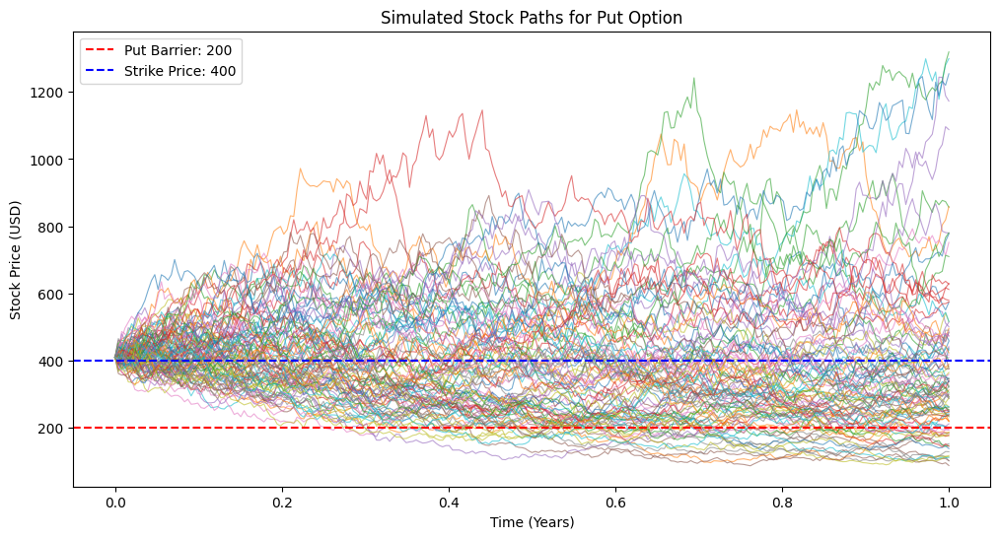
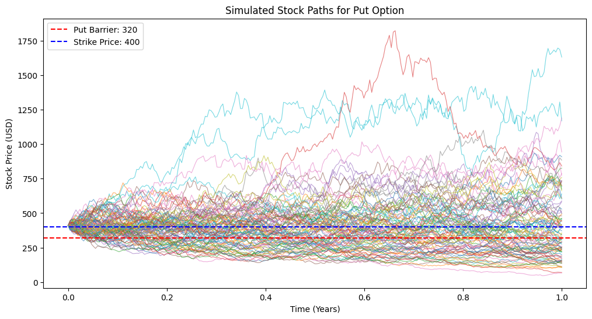
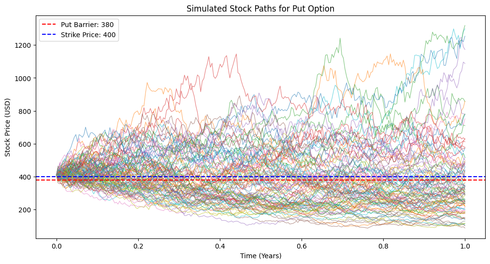

# Barrier Option Pricing for Tesla using Monte Carlo Simulation

A Python-based simulation to estimate the fair prices of *Knock-In Call* and *Put* barrier options for Tesla Inc. (TSLA) using Monte Carlo methods under a Geometric Brownian Motion (GBM) framework.

---

## 📈 Project Overview
This project implements a simulation-based approach to price exotic options that depend on whether the underlying stock price crosses a specific barrier during the contract’s lifetime.

The model:
- Uses **historical Tesla stock data** to estimate volatility
- Simulates **10,000 stock price paths** under GBM
- Evaluates **Knock-In Call** and **Knock-In Put** payoffs
- Discounts payoffs using the **risk-free rate**

---

## 🧮 Methodology
- **Data Source:** Yahoo Finance (`yfinance`)
- **Volatility:** Computed from daily log returns  
  \( \sigma_{annual} = \sigma_{daily} \times \sqrt{252} \)
- **Stock Model:**  
  \( S_{t+\Delta t} = S_t e^{(r - 0.5\sigma^2)\Delta t + \sigma \sqrt{\Delta t}Z} \)
- **Simulation:** 10,000 trajectories × 252 daily steps  
- **Barrier Check:** Option activates only if the barrier is reached

---

## 🧠 Results Summary
| Case | Barrier Levels (Call / Put) | Estimated Prices (Call / Put) |
|------|-----------------------------|-------------------------------|
| 1 | 500 / 320 | 0.32 / 0.72 |
| 2 | 700 / 220 | 11.18 / 22.47 |
| 3 | 440 / 380 | 0.01 / 0.01 |

---

## 🔬 Visualization

| call/put | Graph |
|--------|---------------|
| call-1 |  |
| call-2 |  |
| call-3 |  |
| put-1 |  |
| put-2 |  |
| put-3 |  |
---

**Insights:**
- Option value decreases as the barrier approaches the strike price.  
- Put options are more valuable, reflecting Tesla’s higher downside risk.

---

## 🧩 Technologies Used
`Python` · `NumPy` · `Pandas` · `Matplotlib` · `yfinance`

---

## 🔍 Future Work
- Introduce **stochastic volatility** or **jump-diffusion** models  
- Apply **variance reduction** (e.g., antithetic variates) for efficiency  

---

## 👩‍💻 Author
**Jie**  
M.Sc. in Applied Mathematics and Statistics
📎 [GitHub Profile](https://github.com/JieWang0825)
